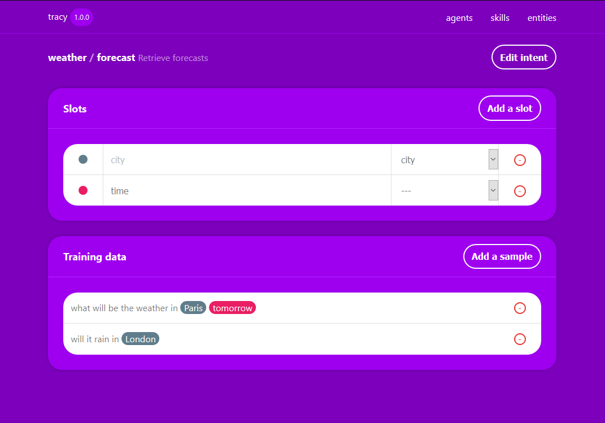

tracy
===

A simple and easy to use trainer to generate **Rasa NLU** and **Snips NLU** needed files.

Inspired by [Chatito](https://rodrigopivi.github.io/Chatito/) and [Rasa NLU Trainer](https://rasahq.github.io/rasa-nlu-trainer/).

## How does that work?

An **agent** represents a project (bot, assistant, whatever).

A **skill** represents what your agent can do. To define its capabilities, you must create **intents** within a skill to keep it logically organized (or you can put all your intents in one skill if you wish).

An **intent** is made of **slots** and **samples**. **Slots** defines what could be extracted from your **samples**. A **slot** could be of a particular **entity** type. This way, you can easily shared common stuff such as locations, enums or so.

Once you have define some **skills**, you can attached them to your **agent** and click the **Train** button to export the resulting dataset.

Data are persisted via LocalStorage as of now.

## Development

Run `npm install` to install packages and `npm start` to start the webpack dev server.
